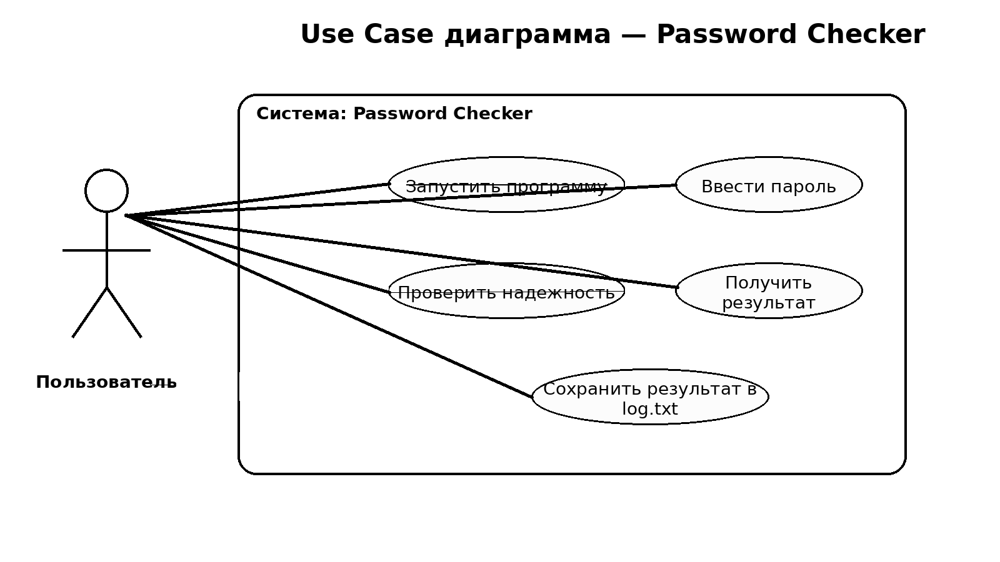
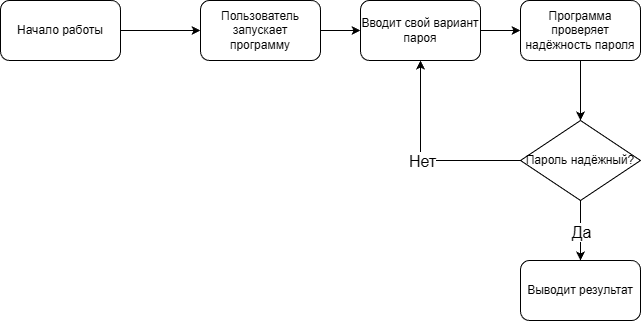

# password-checker-project
Учебный проект по ОП03. Программа проверки надежности паролей.
## Password Checker

Учебный проект по дисциплине Основы алгоритмизации и программирования.

Программа предназначена для проверки надежности паролей пользователей.

## Цели

- Сделать Use Case диаграмму
- Сделать блок-схему алгоритма
- Реализовать программу
- Оформить текст проекта
- Сделать презентацию

## Функционал

Программа позволяет:

- вводить пароль
- проверять его надежность
- выводить результат проверки
- сохранять результат в файл log.txt

# Password Checker Project

Учебный проект по дисциплине **Основы алгоритмизации и программирования (ОП03)**.

Программа предназначена для проверки надёжности пользовательских паролей.

---

# Описание проекта

Password Checker — это приложение, написанное на языке **Python**, которое позволяет пользователю проверить надёжность введённого пароля.

Программа анализирует пароль по нескольким критериям и определяет уровень его сложности.

Если пароль слишком простой, пользователю предлагается придумать более надёжный вариант.

---

# Цель проекта

Разработать программу для проверки надёжности паролей с использованием алгоритмов анализа строк и графического интерфейса пользователя.

---

# Задачи проекта

В рамках разработки программы были поставлены следующие задачи:

1. Проанализировать требования к системе проверки паролей.
2. Изучить критерии оценки сложности паролей.
3. Разработать **Use Case диаграмму взаимодействия пользователя с системой**.
4. Разработать **блок-схему алгоритма работы программы**.
5. Реализовать алгоритм проверки сложности пароля.
6. Создать графический интерфейс пользователя.
7. Реализовать вывод результата проверки.
8. Добавить возможность сохранения результатов проверки в файл `log.txt`.
9. Провести тестирование программы.

---

# Функциональные возможности

Программа позволяет:

- вводить пароль
- проверять его надёжность
- получать результат проверки
- получать рекомендации по улучшению пароля
- сохранять результаты проверки в файл `log.txt`

---

# Use Case диаграмма

---

# Блок-схема алгоритма

---

# Структура проекта

